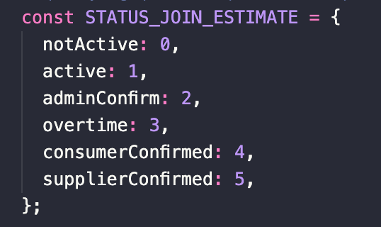

# Docs for api get list deposits

### 6 Enums for deposit status:

1. notActive `(Bị huỷ)`:

- Happen:

  - User canceled order.
  - Admin canceled.

 

- Action:

  - Admin: Nothing

 

2. active

- This case happens 2 abilities:
  - `Chưa duyệt`: join_estimate.expired < now
  - `Quá hạn đặt cọc`: join_estimate.expired > now:
    - Admin can cancel this order if now is more than `3 days` to join_estimate.expired

 

3. adminConfirm (`Đã duyệt`)

 

4. overtime (`Quá hạn tham gia`)

 

5. consumerConfirmed (`Người mua xác nhận đã đến`)

 

6. supplierConfirned (`Người bán xác nhận đã mua`)

 
 

# Website content

### 1. Giới thiệu ngắn gọn về Avatour

Khám phá đậm chất bản địa cùng
 
Avatour

Tất cả trong một ứng dụng du lịch, không cần mất thời gian tìm hiểu và sắp xếp, Avatour gợi ý ngay cho bạn một lịch trình khám phá như ý muốn.

### 2. Giới thiệu USP Gợi ý lịch trình

<b>Có ngay lịch trình như ý chỉ bằng vài cú nhấp chuột</b>

- Chỉ mất "vài click" có ngay một lộ trình khám phá.
- Lịch trình bao gồm chi tiết chỗ ở, khám phá ẩm thực, địa điểm check-in,...
- Địa điểm xét duyệt bởi Avatour và người dân bản địa.

### 3. Giới thiệu tính năng chỉnh sửa tour

<b>Tự tạo cho mình một tour yêu thích</b>

- Để lại dấu ấn cho riêng bạn trên hành trình của mình.
- Chia sẻ địa điểm bạn mới khám phá với bạn bè.
   
  <Bắt đầu ngay>

### 4. Giới thiệu tính năng mua chung

<b>Đi du lịch tiết kiệm cùng Avatour</b>

| Bên trái                                                                                                                | Bên phải                                                                        |
| ----------------------------------------------------------------------------------------------------------------------- | ------------------------------------------------------------------------------- |
| Mua càng nhiều, giá càng ưu đãi                                                                                         | Chúng tôi mang đến hình thức mua hoàn toàn mới                                  |
| Khi bạn mua nhiều hoặc có người tham gia nhóm mua cùng bạn, mọi người sẽ cùng nhận được ưu đãi (Thêm nút tìm hiểu thêm) | Rủ thêm bạn bè và cùng nhau tận hưởng giá ưu đãi từ Avatour, cửa hàng, homestay |

### 5. Mọi người nghĩ gì về Avatour

### 6. Tìm hiểu thêm về chúng tôi

Avatour là Start-up về du lịch, được thành lập từ tháng 5 năm 2022, bởi các bạn sinh viên trường Đại học Ngoại thương. Dự án lập ra với sứ mệnh quảng bá hình ảnh du lịch địa phương Việt mạnh mẽ hơn nữa đến với các bạn trẻ trong nước và quốc tế.

Chúng tôi mong muốn giúp mọi người không cần phải mất hàng giờ lên lịch trình, thay vào đó tập trung vào trải nghiệm trên từng chuyến đi, khám phá chất độc bản Việt Nam với sức trẻ của mình.

#### Chèn thêm một số hình ảnh:

- Business Challenge
- UET Hackathon
- Tiki Hackathon
- Kawai

### 7. QA

<b>1. Tôi xem lịch trình gợi ý như thế nào?</b>
 
Rất đơn giản, bạn chỉ cần vào Avatour, tìm kiếm địa điểm muốn đi, số người, ngày đi,... là đã có ngay một lộ trình nhanh chóng.

<b>2. Avatour có những tour nào?</b>
 
Avatour tập trung vào 4 loại hình du lịch chính: Food tour, Cắm trại, Đi phượt và Team building nha bạn.

<b>3. Tôi tham gia mua chung như thế nào?</b>
 
Bạn cứ ấn Mua ngay như bình thường, sau đó Avatour sẽ cho bạn biết bạn sẽ được hưởng ưu đãi bao nhiêu khi có người tham gia mua cùng bạn. Bạn có thể xem video hướng dẫn sau để hiểu hơn về mua chung nha.
